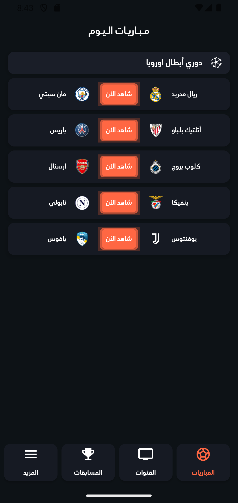
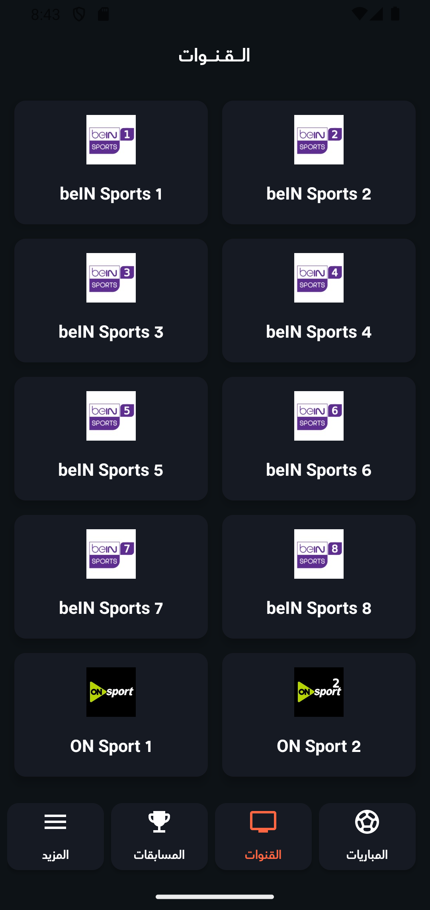
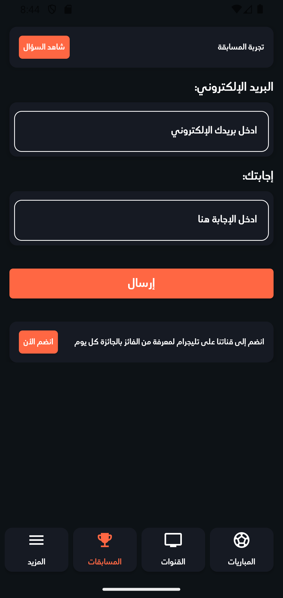
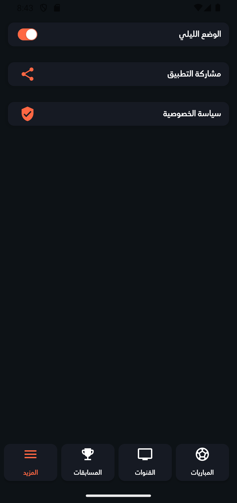
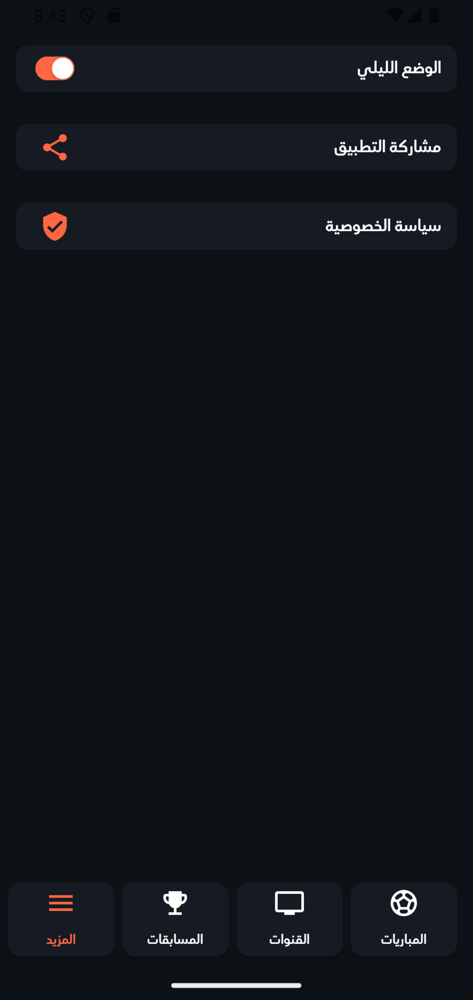

# ⚽ Seen Sport
Seen Sport is an Android application for discovering and watching live sports matches and channels, with support for multiple streaming servers, competitions, and push notifications.​

# 📋 Project Overview
Seen Sport fetches live data from a remote REST API to display today’s matches grouped by league, available TV channels, and interactive competitions.​
Users can open matches or channels via an external video player app and receive Firebase push notifications with rich images when new content or updates are available.​

# 📸 Screenshots
| Matches | Channels | Competitions |
| ------------ | ------------ | ------------ |
|  |  |  |

| More | Competition Locked | Dark & Light Mode |
| ------------ | ------------ | ------------ |
|  |  |  |

# 🛠️ Tech Stack
- Platform: Native Android (Java)​
- Architecture style: Fragments + Adapters + Data Models (MVVM-like separation on data/UI)​
- Networking: Retrofit 2, Gson converter, REST API
- UI & UX: AndroidX, Material Components, ViewBinding, custom dialogs, RecyclerView​
- Media & Images: External video player (via custom URL scheme), Glide for image loading and caching​
- State & Storage: SharedPreferences via App singleton (theme, notification topic, competition lock state)​
- Notifications: Firebase Cloud Messaging, NotificationCompat, image notifications​

# 🏗 Architecture
The app is structured around a single MainActivity hosting four main fragments: Matches, Channels, Competitions, and More, each backed by dedicated adapters and models.​
Networking is centralized in a Retrofit-based ClientApi, while local configuration and user preferences are handled by a lightweight App singleton and Constants/Helper utility classes.​

# ✨ Features
- Today’s matches by league: Fetches matches from the API, groups them by league, and displays headers plus items in a mixed RecyclerView.​
- Live watch state: “Watch” buttons enable only when a match is currently running, based on Cairo timezone and match start/end timestamps.​
- Channels with multiple servers: Lists channels, loads channel servers via API, and lets users pick a server from a dialog to watch.​
- Match servers picker: For each match, available servers are fetched and presented in a reusable servers dialog.​
- Competitions system: Shows competitions, opens Telegram links, validates email/answer, and sends answers to the backend while locking completed competitions on the device.​
- External video player integration: Streams are opened using a custom URL scheme (videoPlayer://play?url=...) targeting a specific player package, with graceful fallback to install the player if missing.​
- Theme toggle: Light/dark theme toggle in the “More” tab using a SwitchButton and persisted in SharedPreferences.​
- Share & privacy links: Built-in sharing flow and privacy policy link from the More screen.​
- Rich push notifications: FCM service supports both simple notifications and big-picture style notifications when an image URL is provided.​

# 📂 Folder Structure

```
app/
└─ src/
   └─ main/
      ├─ java/com/seensport/
      │  ├─ activities/     # MainActivity and app navigation
      │  ├─ api/            # ClientApi, Config (Retrofit & BASE_URL)
      │  ├─ app/            # App (Application & SharedPreferences)
      │  ├─ fragments/      # Matches, Channels, Competitions, More
      │  ├─ adapters/       # RecyclerView adapters (matches, channels, servers...)
      │  ├─ lib/            # LoadingDialog, ServersDialog
      │  ├─ models/         # Response models (matches, channels, competitions...)
      │  ├─ services/       # NotificationService (FCM)
      │  └─ utils/          # Constants, Helper (links, time checks, helpers)
      └─ res/               # layouts, drawables, values
```

# 🚀 How to Run the Project
Prerequisites
- Android Studio (Giraffe or newer).
- Recent Android SDK.
- Device/emulator with internet access.

Setup
- Clone or download the project.
- Open in Android Studio and let Gradle sync.
- Configure Firebase for FCM if needed (add your google-services.json and set up a project in Firebase Console).​
- Configure keys in Constants.java and SDK meta-data in AndroidManifest.xml.

Run
- Choose a device/emulator (API 27+ recommended, supports notification permission and EdgeToEdge).​
- Click Run in Android Studio to install and launch the app.​

# 🔗 Social Links
* GitHub: [youssefmdev22](https://github.com/youssefmdev22)
* LinkedIn: [youssefmdev](https://www.linkedin.com/in/youssefmdev/)
* Facebook: [youssefmdev](https://www.facebook.com/youssefmdev/)
* Email: [youssefmdev22@gmail.com](mailto:youssefmdev22@gmail.com)
